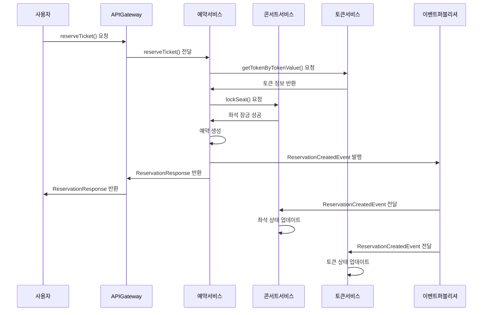
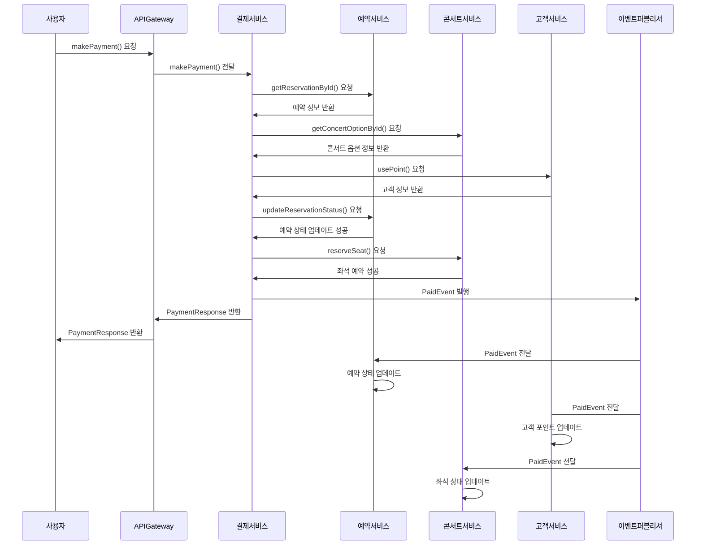
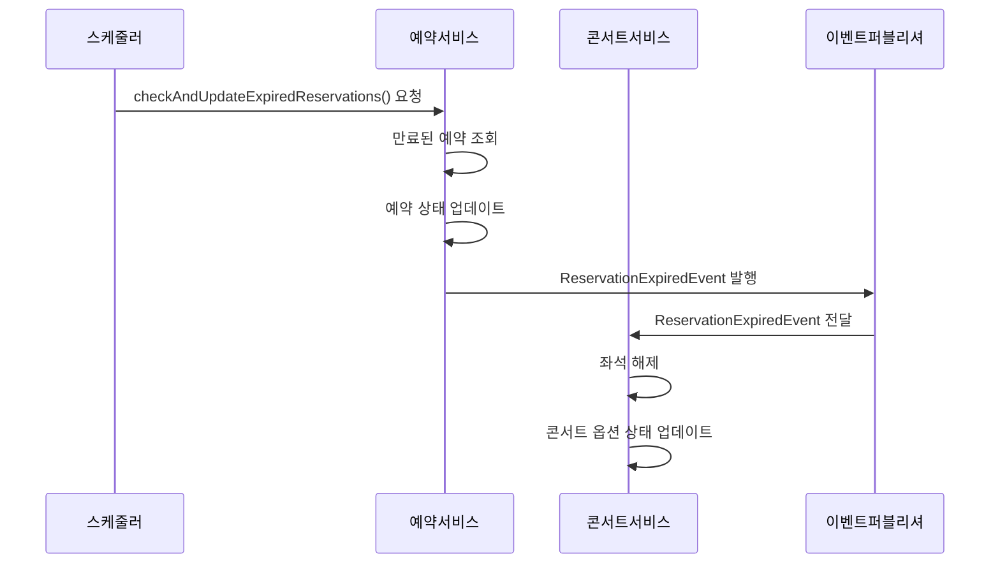
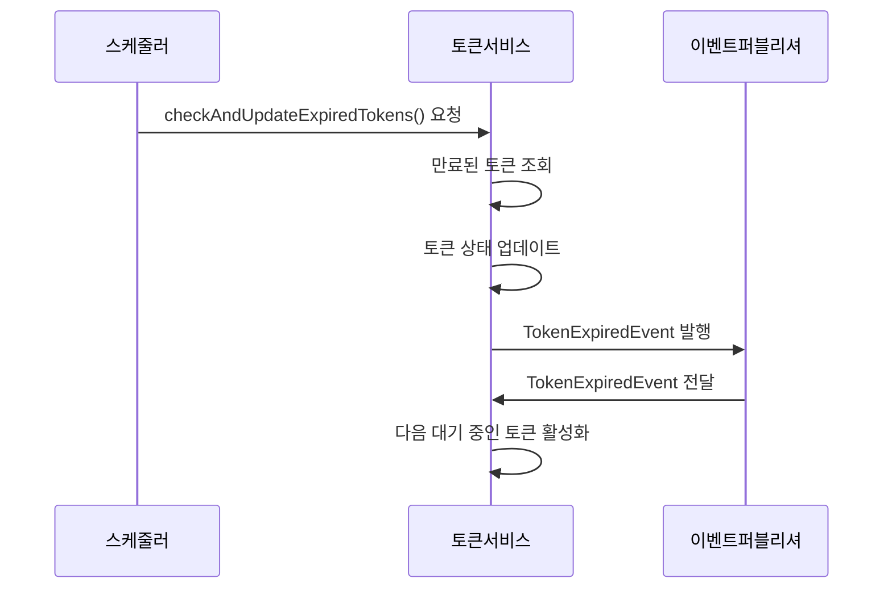
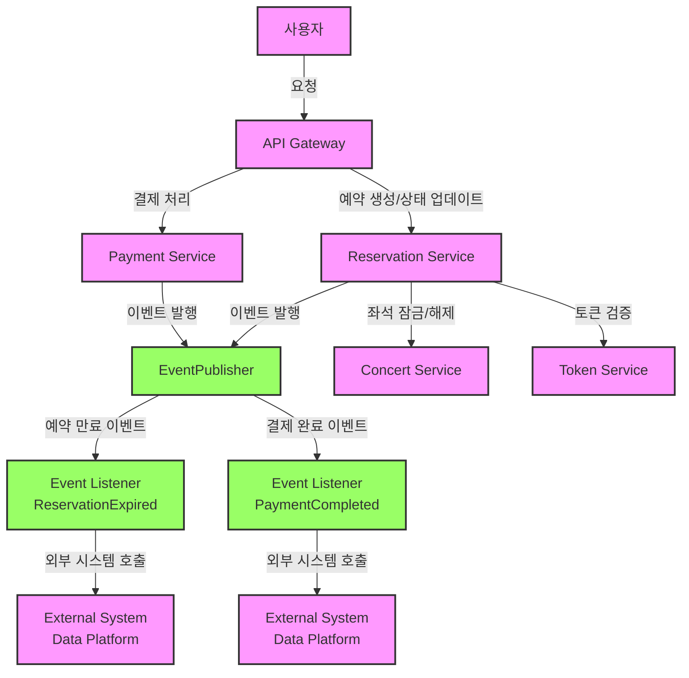

# 마이크로서비스 아키텍처에서의 트랜잭션 처리 및 이벤트 기반 비동기 처리 설계

## 목차

1. [서론](#서론)
2. [서비스 분리 및 역할](#서비스-분리-및-역할)
3. [트랜잭션 문제점 및 개선 방안](#트랜잭션-문제점-및-개선-방안)
4. [이벤트 기반 비동기 처리 설계](#이벤트-기반-비동기-처리-설계)
5. [시스템 도면](#시스템-도면)
6. [결론](#결론)

## 서론

기존의 모노리식 서비스는 하나의 코드베이스로 운영되며, 모든 기능과 비즈니스 로직이 한 곳에 통합되어 있습니다. 이는 초기 개발과 배포에는 유리하지만, 서비스 규모가 확장됨에 따라 유지보수성과 확장성에 문제가 발생합니다. 이 보고서에서는 모노리식 서비스의 문제점을 분석하고, 마이크로서비스 아키텍처(MSA)로의 확장 설계를 통해 이를 해결하는 방안을 제시합니다.

## 서비스 분리 및 역할

모노리식 서비스의 문제를 해결하기 위해, 서비스를 독립적인 마이크로서비스로 분리합니다. 각 서비스는 독립적으로 배포되고, 자체 데이터베이스를 가집니다. 주요 서비스로는 다음과 같습니다:

1. **Concert Service**: 콘서트 관련 기능을 담당합니다. 콘서트 생성, 조회, 콘서트 옵션 관리, 좌석 잠금/해제 등의 기능을 제공하며, 콘서트 및 옵션 정보 테이블을 관리합니다.

2. **Reservation Service**: 예약 관련 기능을 담당합니다. 예약 생성, 상태 업데이트, 만료된 예약 처리 등의 기능을 제공하며, 예약 정보 및 좌석 상태 테이블을 관리합니다.

3. **Token Service**: 토큰 관련 기능을 담당합니다. 토큰 발급, 상태 업데이트, 만료된 토큰 처리 등의 기능을 제공하며, 토큰 정보 테이블을 관리합니다.

4. **Payment Service**: 결제 관련 기능을 담당합니다. 결제 처리, 포인트 차감, 결제 이벤트 발행 등의 기능을 제공하며, 결제 기록 테이블을 관리합니다.

5. **Customer Service**: 고객 관련 기능을 담당합니다. 고객 생성, 조회, 포인트 충전 및 사용 등의 기능을 제공하며, 고객 정보 및 포인트 테이블을 관리합니다.

## 트랜잭션 문제점 및 개선 방안

### 문제점 분석

모노리식 서비스에서는 모든 기능이 하나의 트랜잭션 내에서 처리되므로, 트랜잭션 관리가 복잡해집니다. 이는 다음과 같은 문제를 초래합니다:

1. **트랜잭션 경계의 확장**: 여러 기능이 하나의 트랜잭션 내에서 처리되므로 트랜잭션 경계가 넓어져 관리가 어려워집니다.

2. **ACID 보장 어려움**: 모든 기능이 한 트랜잭션 내에서 처리되므로 ACID(Atomicity, Consistency, Isolation, Durability) 속성을 보장하기 어렵습니다.

3. **네트워크 지연**: 외부 시스템과의 통신이 트랜잭션 내에 포함되면 네트워크 지연이 전체 트랜잭션에 영향을 미칩니다.

4. **서비스 간 의존성**: 모노리식 서비스는 모든 기능이 하나의 코드베이스에 통합되어 있으므로 서비스 간 의존성이 높아집니다. 이는 변경과 배포, 확장성에 문제를 초래합니다.

5. **장애 전파**: 모노리식 서비스에서는 하나의 기능 장애가 전체 시스템에 영향을 미칠 수 있습니다.

### 개선 방안

마이크로서비스 아키텍처로의 전환을 통해 트랜잭션 문제를 해결하고, 이벤트 기반 비동기 처리 방식을 도입하여 시스템의 안정성과 확장성을 높일 수 있습니다.

#### PaymentUseCase 개선

기존의 PaymentUseCase는 모든 작업이 하나의 트랜잭션 내에서 수행되므로, 외부 시스템의 지연이나 실패가 전체 트랜잭션에 영향을 미쳤습니다. 이를 개선하기 위해, 이벤트 발행을 트랜잭션 외부로 이동하여 비동기로 처리하고, 트랜잭션을 간소화합니다.

```java
class PaymentUseCase {
    @Transactional
    public void processPayment(PaymentRequest paymentRequest) {
        executePayment(paymentRequest);
        publishPaymentEvent(paymentRequest);
    }

    @Transactional
    private void executePayment(PaymentRequest paymentRequest) {
        // 유저 포인트 차감, 주문 상태 변경, 결제 정보 저장
    }

    private void publishPaymentEvent(PaymentRequest paymentRequest) {
        eventPublisher.publish(new PaymentCompletedEvent(paymentRequest));
    }
}

class PaymentCompletedEventListener {
    @Async
    @EventListener
    public void handlePaymentCompletedEvent(PaymentCompletedEvent event) {
        try {
            externalSystemClient.sendOrder(event.getPaymentRequest());
        } catch (Exception e) {
            log.error("외부 시스템 호출 실패", e);
        }
    }
}
```

#### ReservationUseCase 개선

기존의 ReservationUseCase는 모든 예약의 상태 업데이트와 좌석 해제를 하나의 트랜잭션으로 처리했습니다. 외부 시스템 호출이 트랜잭션 내에 포함되어 있어 지연이나 실패가 전체 트랜잭션에 영향을 미쳤습니다. 이를 개선하기 위해, 만료된 예약 상태 업데이트와 좌석 해제를 트랜잭션 내에서 처리하고, 외부 시스템 호출은 이벤트로 비동기 처리합니다.

```java
class ReservationUseCase {
    @Transactional
    public void checkAndUpdateExpiredReservations() {
        executeExpirationCheck();
        publishExpirationEvents();
    }

    @Transactional
    private void executeExpirationCheck() {
        // 만료된 예약 상태 업데이트, 좌석 해제
    }

    private void publishExpirationEvents() {
        eventPublisher.publish(new ReservationExpiredEvent());
    }
}

class ReservationExpiredEventListener {
    @Async
    @EventListener
    public void handleReservationExpiredEvent(ReservationExpiredEvent event) {
        try {
            externalSystemClient.updateExpiredReservations(event.getExpiredReservations());
        } catch (Exception e) {
            log.error("외부 시스템 호출 실패", e);
        }
    }
}
```

#### TokenUseCase 개선

기존의 TokenUseCase는 모든 토큰 상태 업데이트를 하나의 트랜잭션으로 처리했습니다. 이를 개선하기 위해, 만료된 토큰 상태 업데이트는 트랜잭션 내에서 처리하고, 외부 시스템 호출은 이벤트로 비동기 처리합니다.

```java
class TokenUseCase {
    @Transactional
    public void checkAndUpdateExpiredTokens(Long concertId, int maxActiveTokens) {
        executeTokenExpirationCheck(concertId, maxActiveTokens);
        publishTokenExpirationEvents(concertId, maxActiveTokens);
    }

    @Transactional
    private void executeTokenExpirationCheck(Long concertId, int maxActiveTokens) {
        // 만료된 토큰 상태 업데이트
    }

    private void publishTokenExpirationEvents(Long concertId, int maxActiveTokens) {
        eventPublisher.publish(new TokenExpiredEvent(concertId, maxActiveTokens));
    }
}

class TokenExpiredEventListener {
    @Async
    @EventListener
    public void handleTokenExpiredEvent(TokenExpiredEvent event) {
        try {
            externalSystemClient.updateExpiredTokens(event.getConcertId(), event.getMaxActiveTokens());
        } catch (Exception e) {
            log.error("외부 시스템 호출 실패", e);
        }
    }
}
```

## 이벤트 기반 비동기 처리 설계

### 예약 생성 흐름도 (Reservation Creation)



### 결제 처리 흐름도 (Payment Processing)



### 만료된 예약 처리 흐름도 (Expired Reservation Handling)





## 시스템 도면



**각 서비스 설명**

1. **API Gateway**:
    - 사용자의 요청을 받아 적절한 서비스로 라우팅.

    2. **Reservation Service**:
    - 예약 생성, 상태 업데이트, 만료된 예약 처리.
    - 트랜잭션 내에서 핵심 비즈니스 로직 처리 후 이벤트 발행.

3. **Event Publisher**:
    - 트랜잭션이 완료된 후 이벤트를 발행하여 비동기로 외부 시스템 호출.

4. **Payment Service**:
    - 결제 처리, 포인트 차감, 결제 정보 저장.
    - 트랜잭션 내에서 핵심 비즈니스 로직 처리 후 이벤트 발행.

5. **Event Listener (PaymentCompleted)**:
    - 결제 완료 이벤트를 비동기로 처리.
    - 외부 시스템 (Data Platform)에 주문 정보 전송.

6. **Concert Service**:
    - 콘서트 관련 기능 (좌석 잠금/해제, 콘서트 옵션 관리).
    - 만료된 예약 이벤트를 비동기로 처리.

7. **Event Listener (ReservationExpired)**:
    - 만료된 예약 이벤트를 비동기로 처리.
    - 외부 시스템 (Data Platform)에 만료된 예약 정보 전송.

## 결론

이 보고서에서는 마이크로서비스 아키텍처에서 트랜잭션 문제를 해결하고 이벤트 기반 비동기 처리 방식을 도입하여 시스템의 안정성과 확장성을 높이는 방안을 제시했습니다. 각 서비스는 독립적으로 운영되며, 이벤트를 통해 비동기적으로 상호작용하여 시스템의 지연이나 실패가 전체 트랜잭션에 영향을 미치지 않도록 설계했습니다.